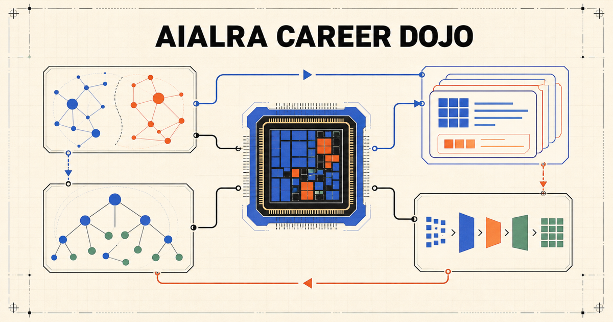
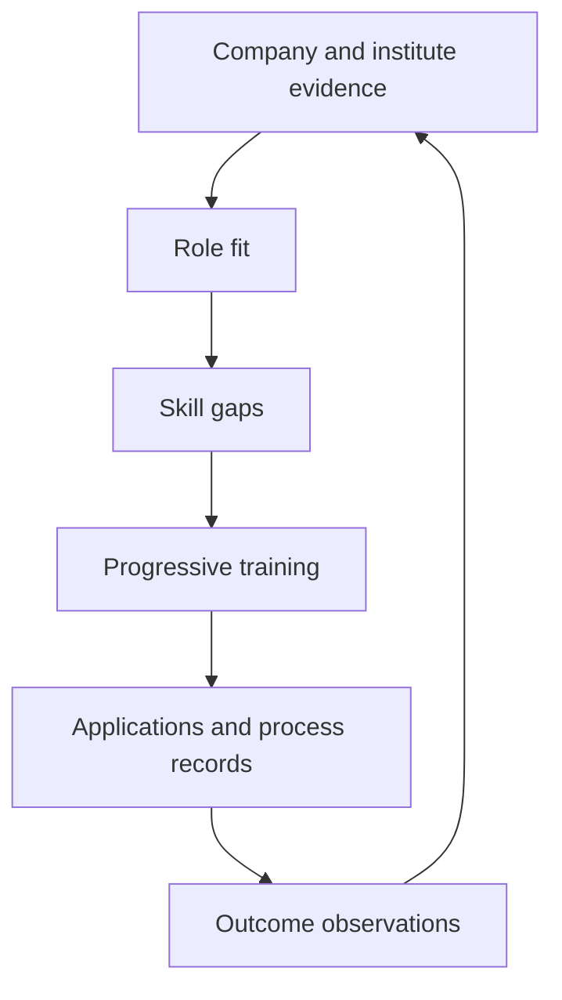
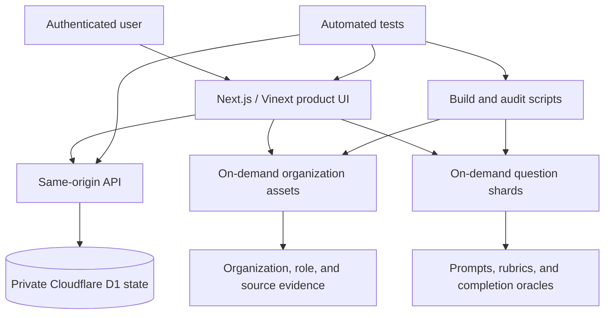
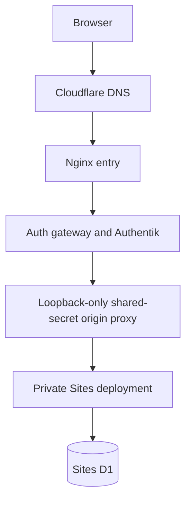

<div align="center">



# AIALRA Career Dojo

**Evidence-driven career intelligence and interview training for semiconductor, EDA, and AI-hardware careers**

[](package.json)
[](data/question-translations)
[](#2-current-evidence-snapshot)
[](#6-privacy-and-security-boundaries)

[中文](README.md) · [Quick start](#7-local-development) · [Research](#5-research-and-audit-documents) · [Quality gates](#9-quality-gates)

</div>

> This public repository stores anonymized product templates, research evidence, and training content, never real candidate education, immigration, contact, application, or credential data

## 1. Purpose

AIALRA Career Dojo is a private-use, evidence-driven career intelligence and interview training system for semiconductor, EDA, verification, RTL/FPGA, architecture, physical design, AI hardware, research, and adjacent engineering careers



Figure 1. The evidence-to-outcome career training loop

The foundation stores evidence, training attempts, application state, and outcome observations. It deliberately does not infer rejection causes or automatically reweight skills from sparse outcomes

### 1.1 Covered career tracks

- EDA R&D and AI-assisted EDA
- RTL, FPGA, design verification, DFT, and physical design
- Architecture, analog/custom design, and embedded systems
- Manufacturing automation, AI hardware, and engineering research
- Behavioral interviews, project deep dives, and technical English communication

## 2. Current evidence snapshot

The organization and question evidence snapshot is **2026-07-23**. The current-job and compensation evidence snapshot is **2026-07-26**

Table 1. Auditable data inventory

| Layer | Current scale | Evidence boundary |
| --- | ---: | --- |
| Organization-market nodes | 799 | 360 in the U.S.-first universe and 439 in the China-first universe |
| Organization taxonomy | 3 market roots, 20 organization types, 595 live category keys | Normalized into 528 cross-market groups and decomposed into 531 bilingual atomic filters |
| Organization names | 799 | 643 reviewed Chinese/English display pairs and 156 explicitly English-only names where no reviewed Chinese name exists |
| China `company` ownership records | 302 / 302 | 88 provisionally classified from explicit source tags; 214 remain mixed or unknown pending direct control evidence |
| Ownership evidence entries | 340 | 27 direct ownership-registry entries and 313 organization-context review sources, distinguished in the UI |
| Normalized role families | 15 | 2,217 audited organization-to-role edges |
| Compensation benchmark families | 12 | U.S. BLS OEWS May 2025 P25/P50/P75 wage benchmarks and separate China government recruitment-pay proxies |
| Cross-cutting capability families | 3 | Not occupations, so no salary is invented |
| Current-job observations | 2 | First-party observations preserving the employer's `not-disclosed` compensation state instead of showing zero or a market proxy as an offer |
| Atomic skills | 130 | Prerequisite relationships and 177 bilingual atomic display terms |
| Bilingual training tasks | 2,100 | 210 independently authored field-aligned anchor scenarios plus nine progressive drills per anchor, producing 140 tasks per role family |
| Question-bank version | 2026-07-23.5 | SHA-256 `0ab07ee28bb1c4221939f017ee8df755bcbf6ac1a3dd1df7473912def1b1eedf` |

The system also persists applications, bookmarks, skill progress, attempts, aggregate mastery statistics, and private candidate preferences

The organization layer is a research universe, not a claim that every organization has an open requisition today. Re-verify time-sensitive job, eligibility, visa, export-control, and deadline decisions against the specific official posting before applying

## 3. Product capabilities

Table 2. Product surfaces and scope

| Capability | Implemented scope |
| --- | --- |
| Mission control | Adaptive next-action queue |
| Organization atlas | Searchable bilingual U.S./China company and institute universe with digest-verified, on-demand access to all 799 profiles |
| Capability graph | Canonical company → role → skill → prerequisite graph |
| Interview Dojo | Foundation-to-advanced training with provenance and review status |
| Bilingual question bank | Side-by-side prompts, rubrics, failure patterns, follow-ups, reference outlines, and observable completion oracles |
| Lightweight delivery | Compact question index and on-demand static shards so the full bank does not inflate the first page |
| Role readiness | Evidence-based estimates without fabricated acceptance probabilities |
| Requisition fact sheet | Role ID, family, team, business unit, level, location, workplace mode, state, responsibilities, qualifications, eligibility, materials, funnel stage, and evidence-backed compensation status, range, and source |
| Training protocol | JD evidence compilation, staged gates, authentic engineering artifacts, bounded hints, evidence reports, fault injection, blind transfer, and outcome feedback |
| Private state | Per-user Cloudflare D1 persistence with authenticated-user isolation |

## 4. Architecture



Figure 2. Relationship between the UI, static evidence assets, private state, and quality gates

Table 3. Repository map

| Path | Contents |
| --- | --- |
| [`app/`](app) | UI, routes, state API, and matching logic |
| [`data/`](data) | Organizations, roles, skills, compensation, question bank, and release manifest |
| [`research/`](research) | Coverage contracts, methods, independent audits, and release verification |
| [`scripts/`](scripts) | Data generation, static asset builds, and source-link audits |
| [`db/`](db) and [`drizzle/`](drizzle) | D1 access, schema, and migration |
| [`tests/`](tests) | Data contracts, privacy, identity isolation, rendering, and deployment security tests |
| [`deploy/`](deploy) | Private deployment guidance and operations scripts; the public README omits real production addresses and credentials |

## 5. Research and audit documents

Table 4. Research index

| Topic | Documents |
| --- | --- |
| Coverage | [Coverage contract](research/coverage-contract.md) |
| Organization universe | [U.S. universe](research/us-company-universe.md) · [China universe](research/china-company-universe.md) |
| Strategy and competition | [Strategy framework](research/strategy-framework.md) · [Competitive landscape](research/competitive-landscape.md) |
| Compensation | [Compensation methodology](research/compensation-methodology.md) |
| Training content | [Interview content contract](research/interview-content-contract.md) · [Bilingual question-bank v2 design and audit](research/bilingual-question-bank-v2.md) |
| Independent audits | [Pre-fix audit](research/question-bank-quality-audit-v2.md) · [Post-fix audit](research/question-bank-quality-audit-v3.md) · [v4 release verification](research/release-verification-v4.md) |
| Organization structure | [Bilingual organization-tree audit](research/organization-tree-bilingual-audit.md) · [China ownership audit](research/china-company-ownership-audit.md) · [Organization-relations audit](research/organization-relations-audit.md) |

### 5.1 Evidence and content policy

Every time-sensitive claim should carry a source, observation date, and confidence. Paid question banks, leaked online assessments, NDA content, close paraphrases of competitor questions, and stealth live-interview assistance are excluded

Training content uses original engineering scenarios, public concepts, official documentation, and license-reviewed open material. `review-ready` means a task passed structural and source checks but still needs domain-expert and learner-pilot calibration. It is not an industry-certified score, and its self-score does not change role readiness

## 6. Privacy and security boundaries

Table 5. Public and private information boundary

| Safe for the repository | Must remain private |
| --- | --- |
| Anonymized templates, public research sources, original training scenarios, and non-sensitive fixtures | Real education, immigration or visa status, contacts, application timelines, and application records |
| Example configuration keys, public schemas, and redacted deployment topology | Accounts, passwords, access tokens, API keys, shared secrets, private addresses, and real production URLs |
| Reviewed aggregate statistics and version summaries | Raw candidate profiles, personal notes, and authenticated preference data |

This is a public repository. The checked-in candidate profile is an anonymized template. Real candidate facts belong under the ignored `private/` directory and, after deployment, only in the authenticated site's private D1 preference store

## 7. Local development

The `package.json` engine floor is Node.js 22.15. Node.js 22.18 or newer is recommended because it enables TypeScript type stripping by default and can load the `.ts` file imported by the test suite without an extra flag [1]

First, install dependencies

```bash
npm install # Install the dependency versions recorded by the lockfile
```

Second, start local development

```bash
npm run dev # Build static evidence assets and start the development server
```

Third, open `http://localhost:3000`

On Node.js 22.15 through 22.17, enable type stripping explicitly

```bash
NODE_OPTIONS=--experimental-strip-types npm test # Let older Node.js releases load TypeScript files imported by the tests
```

## 8. Production deployment

The public README does not expose the production entry point, internal hostnames, service accounts, or secrets. The deployment topology is



Figure 3. Redacted production access path

See [`deploy/README.md`](deploy/README.md) for operational guidance. Neither the Sites bypass bearer nor the proxy shared secret belongs in Git. Public documentation should use a reserved example such as `https://deployment.example` instead of a real production domain

## 9. Quality gates

First, run the deterministic offline gate

```bash
npm run validate # Run data audit, type checking, lint, tests, and the production build
```

On Node.js 22.15 through 22.17, apply the same compatibility flag to the full gate

```bash
NODE_OPTIONS=--experimental-strip-types npm run validate # Run the complete gate with TypeScript loading enabled
```

The gate audits cross-file IDs, graph cycles, role mapping, evidence fields, all 799 organization-name decisions, the complete 20-type and 595-category bilingual taxonomy, all 177 atomic skill display terms, question quality and coverage, all 1,512 technical source-scenario payloads, all 168 minimal-invalid-fixture exercises, all 168 contract-only exercises, the complete TAP fixture lineage, privacy boundaries, TypeScript, lint, production output, server rendering, API authentication, user isolation, request validation, cache privacy, and the generated D1 migration

It also verifies compensation-source semantics, non-disclosure handling, legacy application-table migration, Authentik proxy identity, same-origin mutation enforcement, and deployment secret boundaries

Second, run the network audit only when refreshing the evidence snapshot

```bash
npm run audit:links # Check source URLs and classify failures for human review
```

The link audit distinguishes confirmed missing pages from access-controlled, rate-limited, timed-out, and other pages needing browser review, so it is intentionally outside the deterministic offline gate

## 10. Known boundaries

- Current-job and compensation observations remain a small evidence set and should not be generalized into a complete market conclusion
- `review-ready` tasks still need domain-expert and learner calibration
- The three cross-cutting capability families are not occupations and receive no salary estimate
- Organization nodes represent research coverage, not real-time hiring status
- The repository currently has no `LICENSE` file; public visibility does not grant permission to copy, modify, or redistribute the work

## 11. Language

The Chinese [README.md](README.md) is the default entry point. This English file should remain aligned with its data snapshots, privacy boundary, commands, and validation results

## 12. Reference

[1] Node.js, “Node.js 22.18.0,” 2025. [Online]. Available: https://nodejs.org/en/blog/release/v22.18.0
