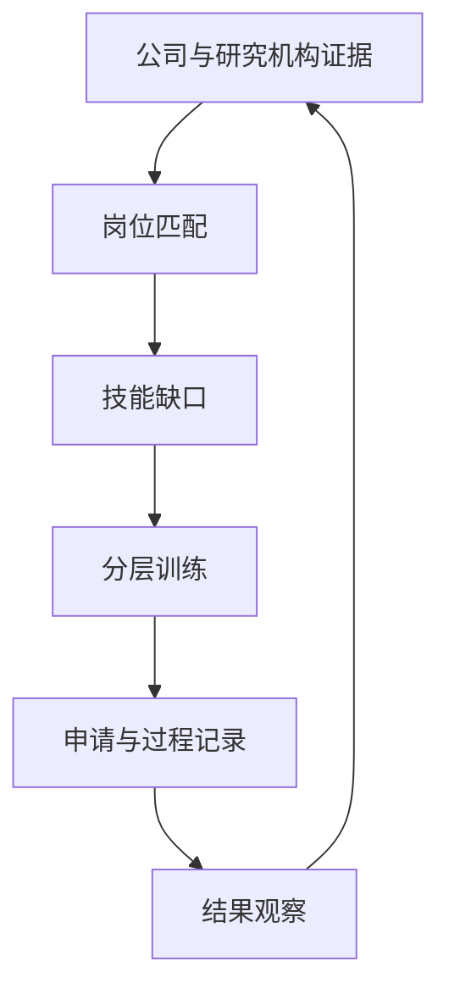
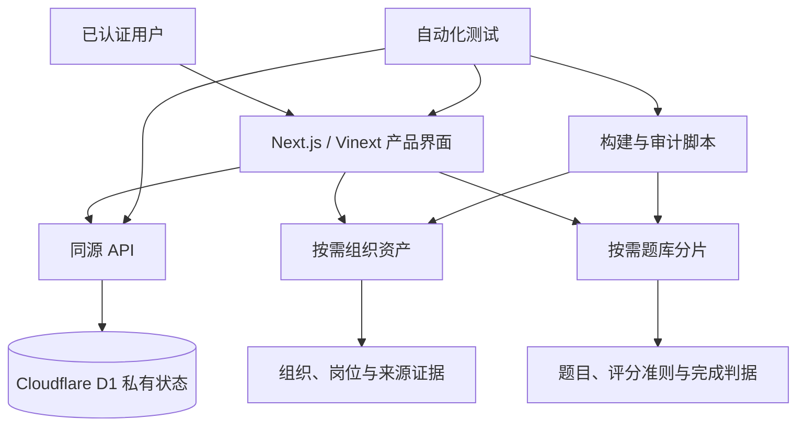
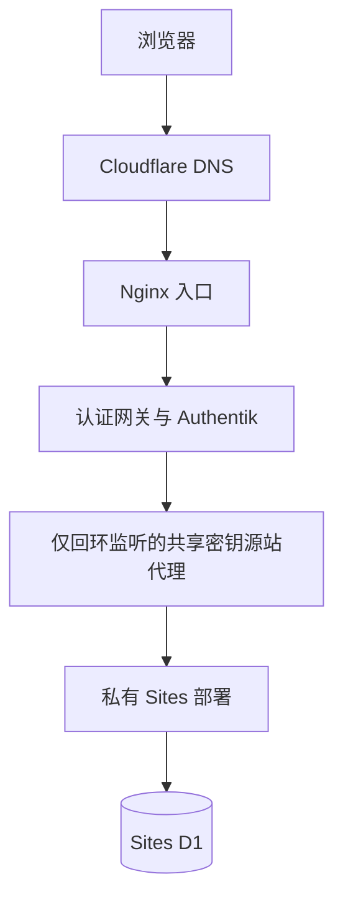

<div align="center">


图 1 项目视觉概览

# AIALRA Career Dojo

**面向半导体、电子设计自动化与人工智能硬件职业发展的证据驱动型情报和面试训练系统**

[](package.json)
[](data/question-translations)
[](#2-当前数据快照)
[](#6-隐私边界)

[English](README.en.md) · [快速开始](#7-本地开发) · [研究文档](#5-研究文档) · [质量门禁](#9-质量门禁)

</div>

> 本仓库公开保存匿名化产品模板、研究证据和训练内容，不保存真实候选人的教育、移民、联系方式、申请记录或账号凭据

## 1 项目定位

AIALRA Career Dojo 是一套私有使用、证据驱动的职业情报与面试训练系统，覆盖半导体、电子设计自动化、验证、RTL/FPGA、计算机体系结构、物理设计、人工智能硬件、科研及相邻工程岗位

系统围绕以下闭环组织信息，并为每个环节保留可审计证据

<div align="center">



图 1.1 从组织证据到结果观察的职业训练闭环

</div>

当前基础设施保存证据、训练尝试、申请状态和结果观察，不会根据少量结果猜测拒绝原因，也不会据此自动调整技能权重

### 1.1 适用方向

- 电子设计自动化研发与人工智能辅助电子设计自动化
- RTL、FPGA、设计验证、DFT 与物理设计
- 体系结构、模拟与定制电路、嵌入式系统
- 制造自动化、人工智能硬件和工程研究岗位
- 行为面试、项目深挖与英文技术沟通

## 2 当前数据快照

本文全部数值根据 [`data/release-manifest.json`](data/release-manifest.json)、项目数据文件和第 5 章研究审计记录

组织和题库证据快照日期为 **2026-07-23**，在职岗位和薪酬证据快照日期为 **2026-07-26**

4 组汇总关系可以直接复算：

$$
799 = 360 + 439,\quad 302 = 88 + 214,\quad 340 = 27 + 313,\quad 2{,}100 = 210 \times (1 + 9)
$$

<div align="center">

表 2.1 当前可审计数据规模

| 数据层 | 当前规模 | 证据边界 |
| --- | ---: | --- |
| 组织市场节点 | 799 | 美国优先市场 360 个，中国优先市场 439 个 |
| 组织分类体系 | 3 个市场根、20 种组织类型、595 个有效分类键 | 归一化为 528 个跨市场组，再拆分为 531 个中英双语原子筛选项 |
| 组织名称 | 799 | 643 个名称具有人工审阅的中英显示对，156 个在缺少可靠中文名时明确保留英文 |
| 中国 `company` 所有权记录 | 302 / 302 | 88 个依据明确来源标签暂定分类，214 个保持混合或未知，等待直接控制权来源 |
| 所有权证据入口 | 340 | 27 个直接所有权登记来源，313 个组织语境审阅来源，界面会区分二者 |
| 标准岗位族 | 15 | 组织到岗位之间包含 2,217 条经过审计的关联边 |
| 薪酬基准岗位族 | 12 | 美国采用美国劳工统计局 2025 年 5 月 P25/P50/P75 工资基准，中国采用政府招聘薪酬代理数据 |
| 跨领域能力族 | 3 | 它们不是职业类别，因此系统不会虚构薪酬 |
| 当前岗位观察 | 2 | 均来自第一方来源，雇主未披露薪酬时保留 `not-disclosed`，不会显示为零或伪装成录用报价 |
| 原子技能 | 130 | 包含先修关系以及 177 个中英双语原子显示词条 |
| 双语训练任务 | 2,100 | 210 个独立编写的岗位锚点场景，加上每个场景 9 个渐进练习，每个岗位族 140 个任务 |
| 题库内容版本 | 2026-07-23.5 | SHA-256 为 `0ab07ee28bb1c4221939f017ee8df755bcbf6ac1a3dd1df7473912def1b1eedf` |

</div>

系统还持久化申请、收藏、技能进展、答题尝试、聚合掌握度统计和私有候选人偏好

组织层表示可研究的组织全集，不代表每个组织当前都在招聘

岗位状态、资格、签证、出口管制和截止日期会随时间变化，申请前必须回到具体官方职位页面复核

## 3 产品能力

<div align="center">

表 3.1 产品界面及能力范围

| 能力域 | 已实现内容 |
| --- | --- |
| 任务驾驶舱 | 根据当前状态生成可调整的下一步队列 |
| 组织图谱 | 可搜索的中美双语公司、研究机构与开放生态图谱，支持按需加载全部 799 个组织档案并校验摘要 |
| 能力图谱 | 统一的公司 → 岗位 → 技能 → 先修关系图 |
| Interview Dojo | 从基础到高级的训练流程，并展示内容来源和审阅状态 |
| 双语题库 | 并排展示中英文题目、评分准则、常见失败模式、追问、参考提纲和可观察完成判据 |
| 轻量加载 | 题目索引和静态分片按需加载，避免把完整题库塞入首屏 |
| 岗位准备度 | 根据已记录证据估计准备度，不生成虚假的录用概率 |
| 职位事实表 | 保存职位编号、岗位族、团队、业务单元、级别、地点、办公模式、发布状态、职责、最低和优先资格、准入要求、材料、漏斗阶段及有来源的薪酬状态或区间 |
| 训练协议 | 覆盖职位描述证据整理、分阶段门禁、真实工程产物、有限提示、证据报告、故障注入、盲迁移和结果反馈 |
| 私有状态 | 通过 Cloudflare D1 保存每位已认证用户的数据，并隔离不同用户 |

</div>

## 4 系统结构

<div align="center">



图 4.1 产品界面、静态证据资产、私有状态及质量门禁之间的关系

</div>

<div align="center">

表 4.1 仓库主要目录

| 路径 | 内容 |
| --- | --- |
| [`app/`](app) | 产品界面、路由、状态接口和匹配逻辑 |
| [`data/`](data) | 组织、岗位、技能、薪酬、题库与发布清单 |
| [`research/`](research) | 覆盖合同、方法、独立审计和发布验证 |
| [`scripts/`](scripts) | 数据生成、静态资产构建和来源链接审计 |
| [`db/`](db) 与 [`drizzle/`](drizzle) | D1 数据访问、模式和迁移 |
| [`tests/`](tests) | 数据合同、隐私、身份隔离、渲染和部署安全测试 |
| [`deploy/`](deploy) | 私有部署说明和运维脚本，公开 README 不展示实际生产地址或凭据 |

</div>

## 5 研究文档

<div align="center">

表 5.1 研究入口

| 主题 | 文档 |
| --- | --- |
| 覆盖范围 | [覆盖合同](research/coverage-contract.md) |
| 组织全集 | [美国组织全集](research/us-company-universe.md) · [中国组织全集](research/china-company-universe.md) |
| 策略与竞品 | [策略框架](research/strategy-framework.md) · [竞争格局](research/competitive-landscape.md) |
| 薪酬 | [薪酬方法](research/compensation-methodology.md) |
| 训练内容 | [面试内容合同](research/interview-content-contract.md) · [双语题库 v2 设计与审计](research/bilingual-question-bank-v2.md) |
| 独立质量审计 | [修复前审计](research/question-bank-quality-audit-v2.md) · [修复后审计](research/question-bank-quality-audit-v3.md) · [v4 发布验证](research/release-verification-v4.md) |
| 组织结构审计 | [组织树双语审计](research/organization-tree-bilingual-audit.md) · [中国公司所有权审计](research/china-company-ownership-audit.md) · [组织关系审计](research/organization-relations-audit.md) |

</div>

### 5.1 内容证据政策

所有会随时间变化的事实都应携带来源、观察日期和置信度

系统排除付费题库、泄露的在线测评材料、受保密协议约束的内容、对竞品题目的近似改写，以及隐蔽的实时面试辅助

训练内容只使用原创工程场景、公共概念、官方文档和经过许可审查的开放材料

界面会显示题目状态，`review-ready` 表示题目通过结构和来源检查，仍需领域专家与学习者试用校准

该状态不是行业认证分数，题目自评分也不会直接改变岗位准备度

## 6 隐私边界

<div align="center">

表 6.1 公开信息及私有信息边界

| 可以进入仓库 | 必须留在私有环境 |
| --- | --- |
| 匿名化模板、公共研究来源、原创训练场景、非敏感测试夹具 | 真实教育经历、移民和签证情况、联系方式、申请时间线与申请记录 |
| 示例配置键、公开数据模式、脱敏部署拓扑 | 账号、密码、访问令牌、API 密钥、共享密钥、私有地址和实际生产网址 |
| 经审阅的聚合统计和版本摘要 | 原始候选人档案、个人备注和认证后的偏好数据 |

</div>

本仓库是公开仓库，提交的候选人档案仅为匿名模板；真实资料应保存在 Git 忽略的 `private/` 目录，部署后也只能写入已认证站点的私有 D1 偏好存储

## 7 本地开发

根据 [`package.json`](package.json) 的开发约束，最低环境为 Node.js 22.15

Node.js 22.18 默认启用 TypeScript 类型剥离，可以直接加载测试引用的 `.ts` 文件[1]，因此推荐使用 Node.js 22.18 或更高版本

- 第一步，安装依赖

```bash
npm install # 安装锁定版本的项目依赖
```

- 第二步，启动本地开发服务

```bash
npm run dev # 构建静态证据资产并启动开发服务器
```

- 第三步，在浏览器打开 `http://localhost:3000`

Node.js 22.15 至 22.17 需要显式启用类型剥离：

```bash
NODE_OPTIONS=--experimental-strip-types npm test # 让旧版 Node.js 在测试期间加载直接引用的 TypeScript 文件
```

## 8 生产部署

生产入口、内部主机名、服务账号和密钥均不在公开 README 中展示，部署链路采用以下结构

<div align="center">



图 8.1 已脱敏的生产访问链路

</div>

具体操作见 [`deploy/README.md`](deploy/README.md)，Sites 绕过令牌和代理共享密钥都不能进入 Git，公开文档中的生产域名应使用 `https://deployment.example` 一类保留示例地址

## 9 质量门禁

- 第一步，运行确定性的离线验证

```bash
npm run validate # 依次执行数据审计、类型检查、代码检查、测试和生产构建
```

使用 Node.js 22.15 至 22.17 时，在完整门禁中加入兼容开关：

```bash
NODE_OPTIONS=--experimental-strip-types npm run validate # 在旧版 Node.js 中运行包含 TypeScript 文件的完整测试门禁
```

该门禁根据 [`scripts/audit-data.mjs`](scripts/audit-data.mjs) 和 [`tests/`](tests) 检查以下范围：

- 跨文件标识符、图循环、岗位映射和证据字段
- 799 个组织名称决策，以及 20 种组织类型和 595 个分类键构成的完整双语分类体系
- 177 个原子技能显示词条、题目质量和题库覆盖范围
- 1,512 个技术来源场景载荷、168 个最小无效夹具练习和 168 个仅合同练习
- 完整 TAP 测试夹具谱系、隐私边界、TypeScript 类型检查和代码检查
- 生产构建、服务器渲染、API 认证、用户隔离、请求校验、缓存隐私和生成的 D1 迁移

验证还覆盖薪酬来源语义、未披露薪酬处理、旧版申请表迁移、Authentik 代理身份、同源写操作和部署密钥边界

- 第二步，仅在更新联网证据快照时运行链接审计

```bash
npm run audit:links # 访问来源链接并按失败类型生成需要人工复核的结果
```

链接审计会区分确认丢失、需要权限、限流、超时和其他需要浏览器人工检查的页面，因此它不会进入确定性的离线验证门禁

## 10 已知边界

- 当前岗位和薪酬观察仍是小规模证据集，不能外推成完整市场结论
- `review-ready` 题目仍需领域专家和学习者校准
- 三个跨领域能力族不是职业类别，系统不会为它们生成薪酬
- 组织节点表示研究覆盖范围，不表示实时招聘状态
- 仓库当前没有 `LICENSE` 文件，不应将公开可见误解为已经授予复制、修改或再分发许可

## 11 语言

中文 README 是默认入口，英文版本见 [README.en.md](README.en.md)，两种语言应保持相同的数据快照、隐私边界、命令和验证结论

## 12 参考资料

[1] Node.js, “Node.js 22.18.0,” 2025. [Online]. Available: https://nodejs.org/en/blog/release/v22.18.0
